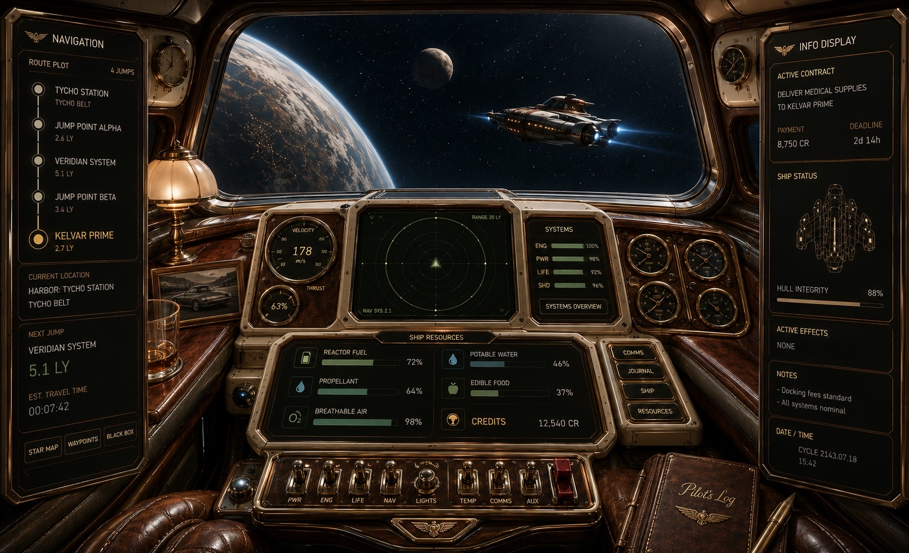
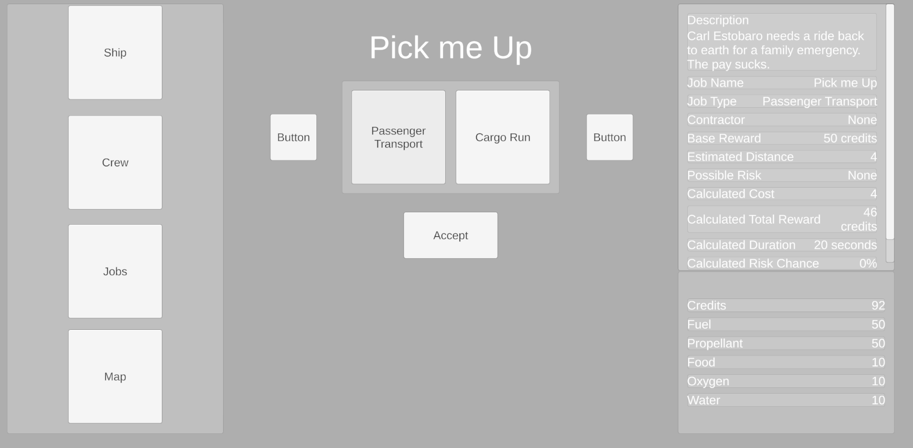
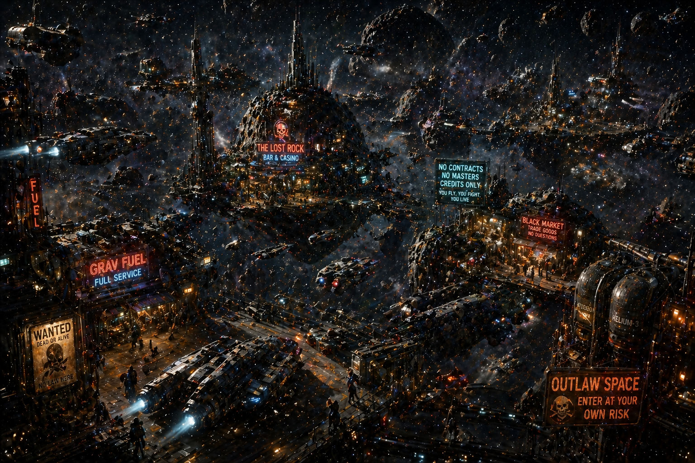

# Dustrunner

A systems-driven space logistics simulator built in Unity and C#.

Players operate independent spacecraft throughout a grounded solar system economy, accepting contracts, managing resources, upgrading ships, and navigating an evolving network of ports, settlements, and trade routes.

---

## Project Vision

Dustrunner focuses on logistics, planning, and long-term progression rather than combat.

The player is not a hero.

The player is a contractor, hauler, explorer, and business owner attempting to survive and prosper in a living interplanetary economy.

---

## Core Systems

Current development includes:

- Procedural contract generation
- Resource consumption systems
- Ship progression
- Port and location networks
- Economic simulation
- Route calculation
- Save/load architecture
- Data-driven content systems

---

## Cockpit Concept

The primary game interface is designed around a spacecraft cockpit that presents navigation, resources, contracts, and ship status through a unified control panel.

---

## Contract System

Early implementation of the procedural contract generation system used to create transport, cargo, and economic opportunities.

---

## Solar System Locations

### Earth Orbit

A dense orbital economy built around trade, transportation, and industry.

### Venus Cloud Cities

Floating settlements suspended above Venus's hostile atmosphere.

### Mars Frontier

Expanding colonies focused on agriculture, manufacturing, and exploration.

### Asteroid Belt

Mining operations, independent stations, smugglers, and frontier commerce.

---

## Technical Highlights

- Unity
- C#
- Scriptable Objects
- Data-driven architecture
- Procedural content generation
- Persistent save systems
- Resource simulation
- Economy systems
- Modular location framework

---

## Development Status

Dustrunner is currently in active development.

The project is focused on building foundational simulation systems before content expansion and visual production.

---

## Dreamsmith Studios

Independent software and game development studio.

Built by Robert Murillo.